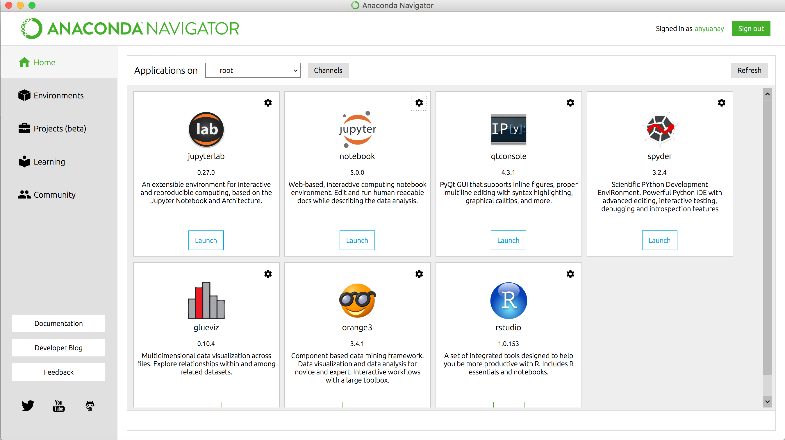

## Set up the Development Environment
To prepare for this lesson, you need a python data analysis environment. For an easy setup, I recommend everybody download and install the latest Anaconda Distribution:
[https://www.anaconda.com/download/](https://www.anaconda.com/download/) 

Once you have installed the Anaconda distribution in your local machines, start the Anaconda Navigator and use the Anaconda Navigator for managing packages and launching Jupyter Notebook. 

#### Now, launch the jupyter notebook and start to code and analyze....
